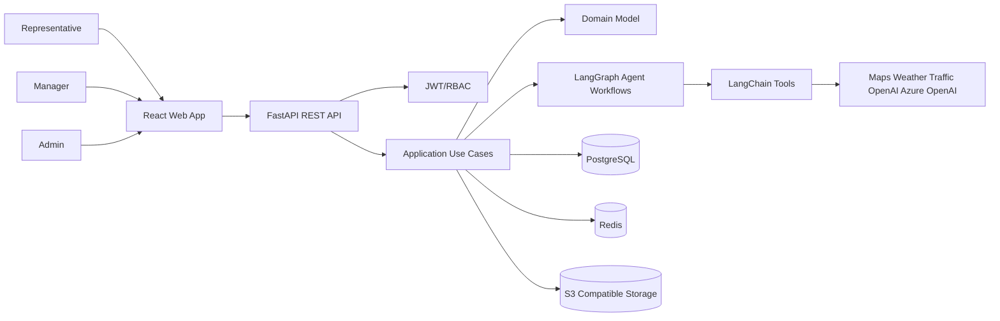

# RouteMind AI Architecture

## Architectural Decisions

RouteMind AI uses Clean Architecture with Domain-Driven Design because pharmaceutical CRM workflows require strict tenant isolation, auditable business decisions, and independently evolvable AI workflows. The domain model remains independent from FastAPI, SQLAlchemy, LangChain, Redis, S3, and external map/weather providers.

## System Context

## Backend Layers

- `domain/`: Entities, value objects, domain services, domain events, business policies.
- `application/`: Use cases, commands, queries, DTOs, transaction boundaries, ports.
- `infrastructure/`: SQLAlchemy repositories, Redis cache, S3 storage, external providers, message adapters.
- `api/`: FastAPI routers, dependencies, OpenAPI versioning, request/response schemas.
- `agents/`, `graphs/`, `tools/`: LangChain tools and LangGraph workflows exposed through application ports.
- `config/`, `middleware/`, `utils/`: Settings, security middleware, observability, common utilities.

## Frontend Layers

- `src/app/`: App bootstrap, providers, query client, router shell.
- `src/components/`: Reusable Shadcn-based UI primitives and enterprise layout components.
- `src/features/`: Feature modules for auth, dashboard, doctors, visits, planning, routes, chat, insights, settings.
- `src/lib/`: API clients, auth token handling, RBAC guards, telemetry.
- `src/routes/`: Route definitions and lazy-loaded route modules.

## Multi-Tenancy

Every tenant-owned table contains `organization_id`. All repository queries must apply organization scoping at the application boundary and enforce it again at the persistence layer. Cross-tenant access is rejected before domain operations execute. Audit logs record actor, organization, action, resource, and request metadata.

## Dynamic Doctor Priority

Doctor priority is never stored as a static column. It is computed by a priority strategy using configurable weighted rules:

- Visit frequency and target cadence
- Time since last visit
- Prescription trend and product relevance
- Engagement score from historical interactions
- Campaign priority and recent launches
- Manager recommendations
- Territory goals
- Missed or overdue visits

Rules are stored in organization settings and evaluated by application services so managers can tune weights without schema changes.

## AI Workflow Strategy

LangGraph coordinates specialized agents: intent detection, doctor search, pre-call planning, route optimization, conversation, post-call extraction, CRM update, summarization, memory, and supervision. Agents access domain data only through audited tools and application ports, never by direct database access.

## Security and Compliance Baseline

- Passwords are hashed with a modern adaptive algorithm.
- Access tokens are short-lived JWTs; refresh tokens are persisted, rotated, and revocable.
- RBAC uses roles, permissions, and organization membership.
- Soft deletion preserves auditability.
- Attachments are stored in S3-compatible storage with metadata in PostgreSQL.
- All write actions create audit log entries.
