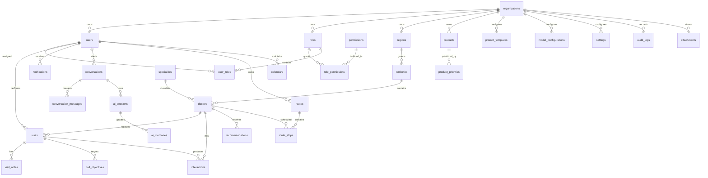

# ER Diagram

```mermaid
erDiagram
  organizations ||--o{ users : owns
  organizations ||--o{ roles : owns
  roles ||--o{ role_permissions : grants
  permissions ||--o{ role_permissions : included_in
  users ||--o{ user_roles : assigned
  roles ||--o{ user_roles : contains
  organizations ||--o{ regions : owns
  regions ||--o{ territories : groups
  territories ||--o{ doctors : contains
  specialities ||--o{ doctors : classifies
  organizations ||--o{ products : owns
  products ||--o{ product_priorities : prioritized_by
  doctors ||--o{ visits : receives
  users ||--o{ visits : performs
  visits ||--o{ visit_notes : has
  visits ||--o{ call_objectives : targets
  visits ||--o{ interactions : produces
  doctors ||--o{ interactions : has
  doctors ||--o{ recommendations : receives
  users ||--o{ notifications : receives
  users ||--o{ conversations : starts
  conversations ||--o{ conversation_messages : contains
  conversations ||--o{ ai_sessions : uses
  ai_sessions ||--o{ ai_memories : updates
  users ||--o{ routes : owns
  routes ||--o{ route_stops : contains
  doctors ||--o{ route_stops : scheduled
  users ||--o{ calendars : maintains
  organizations ||--o{ prompt_templates : configures
  organizations ||--o{ model_configurations : configures
  organizations ||--o{ settings : configures
  organizations ||--o{ audit_logs : records
  organizations ||--o{ attachments : stores
```
